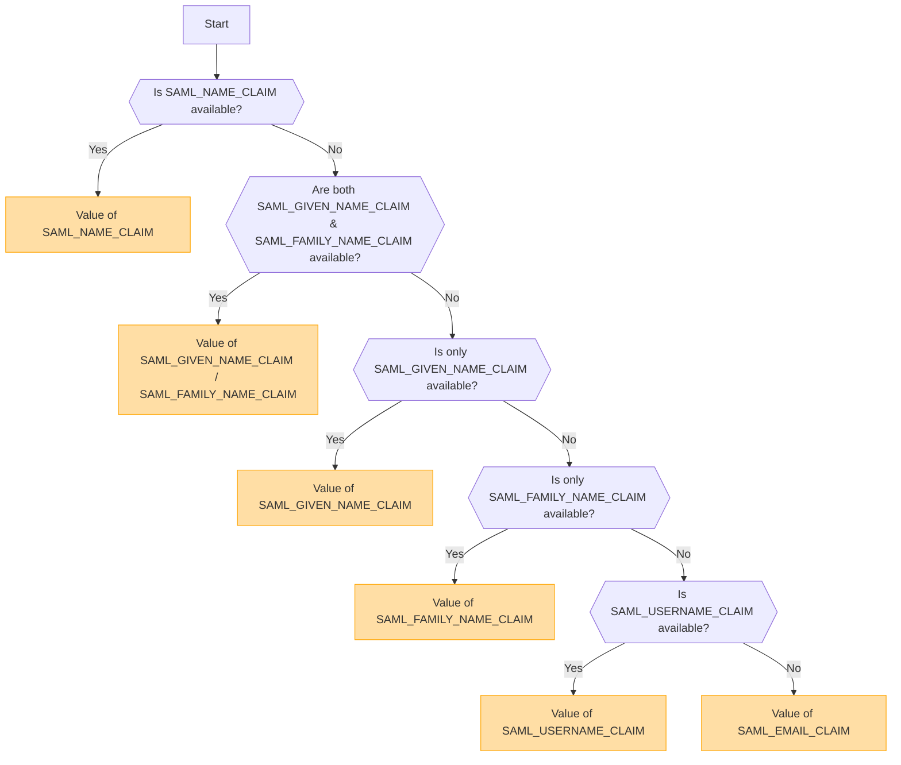

## Übersicht [#overview]

SAML (Security Assertion Markup Language) ist ein weit verbreitetes Authentifizierungsprotokoll, das Single Sign-On (SSO) ermöglicht. Es erlaubt Benutzern, sich einmal bei einem Identity Provider (IdP) zu authentifizieren und Zugriff auf mehrere Dienste zu erhalten, ohne sich erneut anmelden zu müssen.

<Callout type="warning" title="SLO (Single Logout) wird nicht unterstützt">
Single Logout (SLO) wird in dieser Implementierung nicht unterstützt.
</Callout>

<Callout type="warning" title="Gegenseitiger Ausschluss von OpenID und SAML">
Wenn die OpenID-Authentifizierung aktiviert ist, wird die SAML-Authentifizierung automatisch deaktiviert.

Es kann jeweils nur eine Authentifizierungsmethode aktiv sein.
</Callout>

## Aktivierung der Authentifizierungsmethode basierend auf Umgebungsvariablen [#authentication-method-activation-based-on-environment-variables]

Die folgende Tabelle zeigt, welche Authentifizierungsmethode je nach Einstellung der Umgebungsvariablen aktiviert ist:

|   OIDC   |   SAML   | Aktive Authentifizierungsmethode |
| -------- | -------- | ---------------------------- |
| ✅Aktiviert | ❌Deaktiviert | OpenID Connect (OIDC)        |
| ❌Deaktiviert | ✅Aktiviert | SAML                         |
| ✅Aktiviert | ✅Aktiviert | OpenID Connect (OIDC)        |
| ❌Deaktiviert | ❌Deaktiviert | Keine Authentifizierung aktiviert |

## SAML-Zertifikatsformat und -Konfiguration [#saml-certificate-format-and-configuration]

Die Umgebungsvariable `SAML_CERT` wird verwendet, um das Signaturzertifikat des Identity Providers (IdP) zur Validierung von SAML-Antworten anzugeben. Dieses Zertifikat muss im **PEM-Format** bereitgestellt werden und kann auf eine der folgenden Arten angegeben werden:

### Als Dateipfad (relativ oder absolut) [#as-a-file-path-relative-or-absolute]

Wenn `SAML_CERT` auf einen Dateipfad gesetzt ist, lädt die Anwendung das Zertifikat aus der angegebenen Datei.
Sowohl **relative Pfade** als auch **absolute Pfade** werden unterstützt.

```env
# Relative path (resolved based on the application root)
SAML_CERT=idp-cert.pem

# Absolute path
SAML_CERT=/path/to/idp-cert.pem
```

**Beispiel-Dateiinhalt (`idp-cert.pem`):**

```
-----BEGIN CERTIFICATE-----
MIIDazCCAlOgAwIBAgIUKhXaFJGJJPx466rl...
-----END CERTIFICATE-----
```

### Als einzeiliger PEM-String [#as-a-one-line-pem-string]

Das Zertifikat kann auch als **einzeiliger PEM-String** (Base64-kodiert, ohne Zeilenumbrüche) bereitgestellt werden.

```env
SAML_CERT="MIICizCCAfQCCQCY8tKaMc0BMjANBgkqh...W=="
```

Dieses Format ist nützlich, wenn das Zertifikat direkt in Umgebungsvariablen gespeichert wird.

### Als mehrzeiliger PEM-String (mit \n Escape-Sequenzen) [#as-a-multi-line-pem-string-with-n-escape-sequences]

Das Zertifikat kann auch als **mehrzeiliger PEM-String** bereitgestellt werden, wobei Zeilenumbrüche als \n dargestellt werden.

```env
SAML_CERT="-----BEGIN CERTIFICATE-----\nMIIDazCCAlOgAwIBAgIUKhXaFJGJJPx466rl...\n-----END CERTIFICATE-----\n"
```

Dieses Format ist nützlich, wenn Zertifikate in .env Dateien konfiguriert werden, während die vollständige PEM-Struktur beibehalten wird.

### Anforderungen an das Zertifikatsformat [#certificate-format-requirements]
- Das Zertifikat **muss immer im PEM-Format vorliegen** (Base64-kodiertes X.509-Zertifikat).
- Falls es als Datei bereitgestellt wird, muss es ein gültiges **RFC7468 strict textual message PEM format** sein.
- Wenn Sie ein einzeiliges Zertifikat verwenden, stellen Sie sicher, dass der Wert **keine Zeilenumbrüche** enthält.
- Wenn Sie einen mehrzeiligen String verwenden, stellen Sie sicher, dass Zeilenumbrüche als **\n**-Escape-Sequenzen dargestellt werden.

Weitere Details finden Sie in der [node-saml documentation](https://github.com/node-saml/node-saml/tree/master?tab=readme-ov-file#configuration-option-idpcert).


## Ablauf zur Bestimmung des angezeigten Benutzernamens basierend auf SAML-Attributen [#display-username-determination-flow-based-on-saml-attributes]


Bei der SAML-Authentifizierung wird der angezeigte Benutzername gemäß dem folgenden Ablauf bestimmt.



### Bestimmungsregeln [#determination-rules]

1. Wenn `SAML_NAME_CLAIM` bereitgestellt wird, wird dessen Wert als Anzeigename des Benutzers verwendet.
2. Wenn sowohl `SAML_GIVEN_NAME_CLAIM` als auch `SAML_FAMILY_NAME_CLAIM` bereitgestellt werden, werden ihre entsprechenden Werte verkettet, um den Benutzernamen zu bilden.
3. Wenn nur `SAML_GIVEN_NAME_CLAIM` bereitgestellt wird, wird dessen Wert verwendet.
4. Wenn nur `SAML_FAMILY_NAME_CLAIM` bereitgestellt wird, wird dessen Wert verwendet.
5. Wenn `SAML_USERNAME_CLAIM` bereitgestellt wird, wird dessen Wert verwendet.
6. Wenn keines der oben genannten Attribute angegeben ist, wird `SAML_EMAIL_CLAIM` als Anzeigename für den Benutzer verwendet.

Durch Befolgen dieses Ablaufs wird während der SAML-Authentifizierung ein geeigneter Benutzername ermittelt.

## Konfigurationsbeispiele [#configuration-examples]
  - [Auth0](/docs/configuration/authentication/SAML/auth0)

