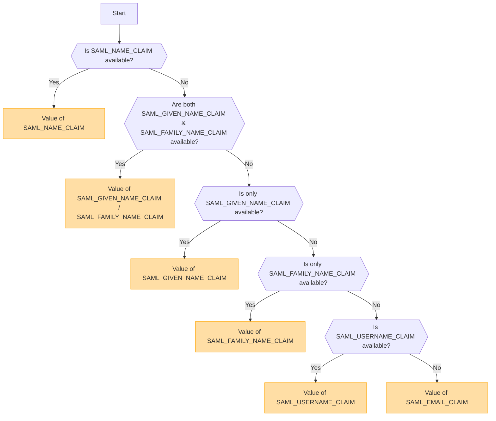

## Descripción general [#overview]

SAML (Security Assertion Markup Language) es un protocolo de autenticación ampliamente utilizado que permite el inicio de sesión único (SSO). Permite a los usuarios autenticarse una vez con un Proveedor de Identidad (IdP) y obtener acceso a múltiples servicios sin necesidad de volver a iniciar sesión.

<Callout type="warning" title="SLO (Single Logout) no es compatible">
Single Logout (SLO) no es compatible con esta implementación.
</Callout>

<Callout type="warning" title="Exclusión mutua de OpenID y SAML">
Si la autenticación OpenID está habilitada, la autenticación SAML se desactivará automáticamente.

Solo un método de autenticación puede estar activo a la vez.
</Callout>

## Activación del método de autenticación basada en variables de entorno [#authentication-method-activation-based-on-environment-variables]

La siguiente tabla indica qué método de autenticación está habilitado dependiendo de la configuración de las variables de entorno:

|   OIDC   |   SAML   | Método de autenticación activo |
| -------- | -------- | ------------------------------ |
| ✅Habilitado | ❌Deshabilitado | OpenID Connect (OIDC)          |
| ❌Deshabilitado | ✅Habilitado | SAML                           |
| ✅Habilitado | ✅Habilitado | OpenID Connect (OIDC)          |
| ❌Deshabilitado | ❌Deshabilitado | Ninguna autenticación habilitada |

## Formato y configuración del certificado SAML [#saml-certificate-format-and-configuration]

La variable de entorno `SAML_CERT` se utiliza para especificar el certificado de firma del Proveedor de Identidad (IdP) para validar las Respuestas SAML. Este certificado debe proporcionarse en **formato PEM** y puede especificarse de una de las siguientes maneras:

### Como una ruta de archivo (relativa o absoluta) [#as-a-file-path-relative-or-absolute]

Si `SAML_CERT` se establece en una ruta de archivo, la aplicación cargará el certificado desde el archivo especificado.
Se admiten tanto **rutas relativas** como **rutas absolutas**.

```env
# Relative path (resolved based on the application root)
SAML_CERT=idp-cert.pem

# Absolute path
SAML_CERT=/path/to/idp-cert.pem
```

**Contenido del archivo de ejemplo (`idp-cert.pem`):**

```
-----BEGIN CERTIFICATE-----
MIIDazCCAlOgAwIBAgIUKhXaFJGJJPx466rl...
-----END CERTIFICATE-----
```

### Como una cadena PEM de una sola línea [#as-a-one-line-pem-string]

El certificado también puede proporcionarse como una **cadena PEM de una sola línea** (codificada en Base64, sin saltos de línea).

```env
SAML_CERT="MIICizCCAfQCCQCY8tKaMc0BMjANBgkqh...W=="
```

Este formato es útil al almacenar el certificado directamente en variables de entorno.

### Como una cadena PEM de varias líneas (con secuencias de escape \n) [#as-a-multi-line-pem-string-with-n-escape-sequences]

El certificado también puede proporcionarse como una **cadena PEM multilínea** donde los saltos de línea se representan como \n.

```env
SAML_CERT="-----BEGIN CERTIFICATE-----\nMIIDazCCAlOgAwIBAgIUKhXaFJGJJPx466rl...\n-----END CERTIFICATE-----\n"
```

Este formato es útil al configurar certificados en archivos .env mientras se preserva la estructura PEM completa.

### Requisitos de formato de certificado [#certificate-format-requirements]
- El certificado **debe estar siempre en formato PEM** (certificado X.509 codificado en Base64).
- Si se proporciona como archivo, debe ser un **formato PEM de mensaje textual estricto RFC7468** válido.
- Al usar un certificado de una sola línea, asegúrese de que **no haya saltos de línea** en el valor.
- Al usar una cadena multilínea, asegúrese de que los saltos de línea estén representados como secuencias de escape **\n**.

Para más detalles, consulte la [documentación de node-saml](https://github.com/node-saml/node-saml/tree/master?tab=readme-ov-file#configuration-option-idpcert).


## Flujo de determinación del nombre de usuario para mostrar basado en atributos SAML [#display-username-determination-flow-based-on-saml-attributes]


En la autenticación SAML, el nombre de usuario que se muestra se determina de acuerdo con el siguiente flujo.



### Reglas de determinación [#determination-rules]

1. Si se proporciona `SAML_NAME_CLAIM`, su valor se utiliza como el nombre de usuario para mostrar.
2. Si se proporcionan tanto `SAML_GIVEN_NAME_CLAIM` como `SAML_FAMILY_NAME_CLAIM`, sus valores correspondientes se concatenan para formar el nombre de usuario.
3. Si solo se proporciona `SAML_GIVEN_NAME_CLAIM`, se utiliza su valor.
4. Si solo se proporciona `SAML_FAMILY_NAME_CLAIM`, se utiliza su valor.
5. Si se proporciona `SAML_USERNAME_CLAIM`, se utiliza su valor.
6. Si no se proporciona ninguno de los atributos anteriores, se utiliza `SAML_EMAIL_CLAIM` como el nombre de usuario para mostrar.

Al seguir este flujo, se determina un nombre de usuario apropiado durante la autenticación SAML.

## Ejemplos de configuración [#configuration-examples]
  - [Auth0](/docs/configuration/authentication/SAML/auth0)

