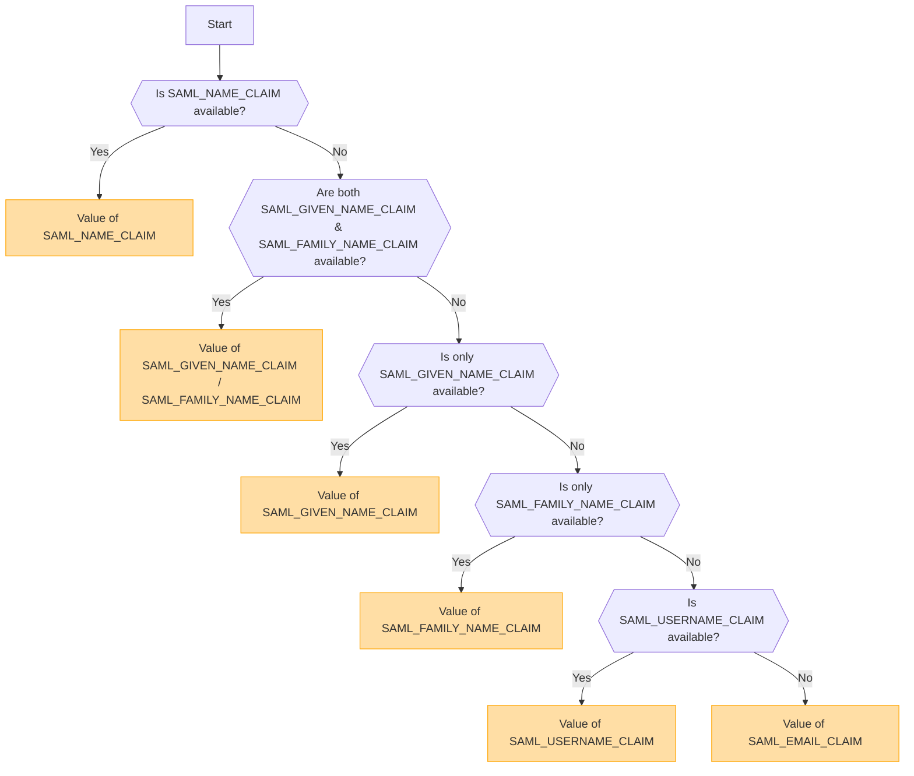

## Vue d'ensemble [#overview]

SAML (Security Assertion Markup Language) est un protocole d'authentification largement utilisé qui permet l'authentification unique (SSO). Il permet aux utilisateurs de s'authentifier une seule fois auprès d'un fournisseur d'identité (IdP) et d'accéder à plusieurs services sans avoir à se reconnecter.

<Callout type="warning" title="SLO (Single Logout) non pris en charge">
La déconnexion unique (Single Logout - SLO) n'est pas prise en charge dans cette implémentation.
</Callout>

<Callout type="warning" title="Exclusion mutuelle d'OpenID et de SAML">
Si l'authentification OpenID est activée, l'authentification SAML sera automatiquement désactivée.

Une seule méthode d'authentification peut être active à la fois.
</Callout>

## Activation de la méthode d'authentification basée sur les variables d'environnement [#authentication-method-activation-based-on-environment-variables]

Le tableau suivant indique quelle méthode d'authentification est activée en fonction des paramètres des variables d'environnement :

|   OIDC   |   SAML   | Méthode d'authentification active |
| -------- | -------- | --------------------------------- |
| ✅Activé | ❌Désactivé | OpenID Connect (OIDC)             |
| ❌Désactivé | ✅Activé | SAML                              |
| ✅Activé | ✅Activé | OpenID Connect (OIDC)             |
| ❌Désactivé | ❌Désactivé | Aucune authentification activée   |

## Format et configuration du certificat SAML [#saml-certificate-format-and-configuration]

La variable d'environnement `SAML_CERT` est utilisée pour spécifier le certificat de signature du fournisseur d'identité (IdP) afin de valider les réponses SAML. Ce certificat doit être fourni au **format PEM** et peut être spécifié de l'une des manières suivantes :

### En tant que chemin de fichier (relatif ou absolu) [#as-a-file-path-relative-or-absolute]

Si `SAML_CERT` est défini sur un chemin de fichier, l'application chargera le certificat à partir du fichier spécifié.
Les **chemins relatifs** et les **chemins absolus** sont tous deux pris en charge.

```env
# Relative path (resolved based on the application root)
SAML_CERT=idp-cert.pem

# Absolute path
SAML_CERT=/path/to/idp-cert.pem
```

**Exemple de contenu de fichier (`idp-cert.pem`) :**

```
-----BEGIN CERTIFICATE-----
MIIDazCCAlOgAwIBAgIUKhXaFJGJJPx466rl...
-----END CERTIFICATE-----
```

### En tant que chaîne PEM sur une seule ligne [#as-a-one-line-pem-string]

Le certificat peut également être fourni sous forme de **chaîne PEM sur une seule ligne** (encodée en Base64, sans sauts de ligne).

```env
SAML_CERT="MIICizCCAfQCCQCY8tKaMc0BMjANBgkqh...W=="
```

Ce format est utile lors du stockage du certificat directement dans des variables d'environnement.

### En tant que chaîne PEM multiligne (avec séquences d'échappement \n) [#as-a-multi-line-pem-string-with-n-escape-sequences]

Le certificat peut également être fourni sous forme de **chaîne PEM multiligne** où les retours à la ligne sont représentés par \n.

```env
SAML_CERT="-----BEGIN CERTIFICATE-----\nMIIDazCCAlOgAwIBAgIUKhXaFJGJJPx466rl...\n-----END CERTIFICATE-----\n"
```

Ce format est utile lors de la configuration de certificats dans des fichiers .env tout en préservant la structure PEM complète.

### Exigences de format de certificat [#certificate-format-requirements]
- Le certificat **doit toujours être au format PEM** (certificat X.509 encodé en Base64).
- S'il est fourni sous forme de fichier, il doit s'agir d'un **format PEM de message textuel strict RFC7468** valide.
- Lorsque vous utilisez un certificat sur une seule ligne, assurez-vous qu'il n'y a **aucun saut de ligne** dans la valeur.
- Lorsque vous utilisez une chaîne multiligne, assurez-vous que les sauts de ligne sont représentés par des séquences d'échappement **\n**.

Pour plus de détails, consultez la [documentation de node-saml](https://github.com/node-saml/node-saml/tree/master?tab=readme-ov-file#configuration-option-idpcert).


## Flux de détermination du nom d'utilisateur affiché basé sur les attributs SAML [#display-username-determination-flow-based-on-saml-attributes]


Dans l'authentification SAML, le nom d'utilisateur affiché est déterminé selon le flux suivant.



### Règles de détermination [#determination-rules]

1. Si `SAML_NAME_CLAIM` est fourni, sa valeur est utilisée comme nom d'utilisateur affiché.
2. Si `SAML_GIVEN_NAME_CLAIM` et `SAML_FAMILY_NAME_CLAIM` sont tous deux fournis, leurs valeurs correspondantes sont concaténées pour former le nom d'utilisateur.
3. Si seul `SAML_GIVEN_NAME_CLAIM` est fourni, sa valeur est utilisée.
4. Si seul `SAML_FAMILY_NAME_CLAIM` est fourni, sa valeur est utilisée.
5. Si `SAML_USERNAME_CLAIM` est fourni, sa valeur est utilisée.
6. Si aucun des attributs ci-dessus n'est fourni, `SAML_EMAIL_CLAIM` est utilisé comme nom d'utilisateur affiché.

En suivant ce flux, un nom d'utilisateur approprié est déterminé lors de l'authentification SAML.

## Exemples de configuration [#configuration-examples]
  - [Auth0](/docs/configuration/authentication/SAML/auth0)

