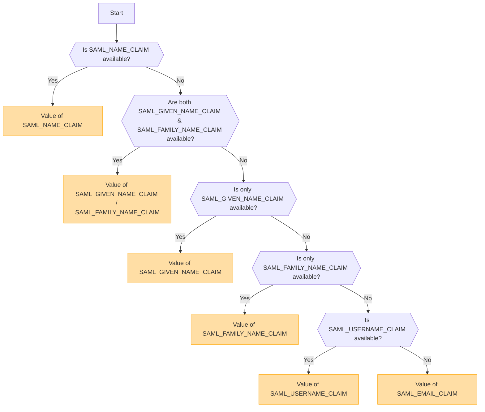

## Ikhtisar [#overview]

SAML (Security Assertion Markup Language) adalah protokol autentikasi yang digunakan secara luas yang memungkinkan Single Sign-On (SSO). Protokol ini memungkinkan pengguna untuk melakukan autentikasi satu kali dengan Identity Provider (IdP) dan mendapatkan akses ke berbagai layanan tanpa perlu masuk kembali.

<Callout type="warning" title="SLO (Single Logout) Tidak Didukung">
Single Logout (SLO) tidak didukung dalam implementasi ini.
</Callout>

<Callout type="warning" title="Eksklusi Timbal Balik OpenID dan SAML">
Jika autentikasi OpenID diaktifkan, autentikasi SAML akan dinonaktifkan secara otomatis.

Hanya satu metode autentikasi yang dapat aktif dalam satu waktu.
</Callout>

## Aktivasi Metode Autentikasi Berdasarkan Variabel Lingkungan [#authentication-method-activation-based-on-environment-variables]

Tabel berikut menunjukkan metode autentikasi mana yang diaktifkan tergantung pada pengaturan variabel lingkungan:

|   OIDC   |   SAML   | Metode Autentikasi Aktif |
| -------- | -------- | ---------------------------- |
| ✅Diaktifkan  | ❌Dinonaktifkan | OpenID Connect (OIDC)        |
| ❌Dinonaktifkan | ✅Diaktifkan  | SAML                         |
| ✅Diaktifkan  | ✅Diaktifkan  | OpenID Connect (OIDC)        |
| ❌Dinonaktifkan | ❌Dinonaktifkan | Tidak ada autentikasi yang diaktifkan    |

## Format dan Konfigurasi Sertifikat SAML [#saml-certificate-format-and-configuration]

Variabel lingkungan `SAML_CERT` digunakan untuk menentukan sertifikat penandatanganan Identity Provider (IdP) untuk memvalidasi Respons SAML. Sertifikat ini harus disediakan dalam **format PEM** dan dapat ditentukan dengan salah satu cara berikut:

### Sebagai Jalur File (Relatif atau Absolut) [#as-a-file-path-relative-or-absolute]

Jika `SAML_CERT` diatur ke jalur file, aplikasi akan memuat sertifikat dari file yang ditentukan.
Baik **jalur relatif** maupun **jalur absolut** didukung.

```env
# Relative path (resolved based on the application root)
SAML_CERT=idp-cert.pem

# Absolute path
SAML_CERT=/path/to/idp-cert.pem
```

**Contoh Isi Berkas (`idp-cert.pem`):**

```
-----BEGIN CERTIFICATE-----
MIIDazCCAlOgAwIBAgIUKhXaFJGJJPx466rl...
-----END CERTIFICATE-----
```

### Sebagai String PEM Satu Baris [#as-a-one-line-pem-string]

Sertifikat juga dapat disediakan sebagai **string PEM satu baris** (dikodekan Base64, tanpa jeda baris).

```env
SAML_CERT="MIICizCCAfQCCQCY8tKaMc0BMjANBgkqh...W=="
```

Format ini berguna saat menyimpan sertifikat secara langsung di dalam environment variables.

### Sebagai String PEM Multi-Baris (dengan urutan escape \n) [#as-a-multi-line-pem-string-with-n-escape-sequences]

Sertifikat juga dapat disediakan sebagai **string PEM multi-baris** di mana baris baru direpresentasikan sebagai \n.

```env
SAML_CERT="-----BEGIN CERTIFICATE-----\nMIIDazCCAlOgAwIBAgIUKhXaFJGJJPx466rl...\n-----END CERTIFICATE-----\n"
```

Format ini berguna saat mengonfigurasi sertifikat di dalam file .env dengan tetap mempertahankan struktur PEM secara utuh.

### Persyaratan Format Sertifikat [#certificate-format-requirements]
- Sertifikat **harus selalu dalam format PEM** (sertifikat X.509 yang dikodekan Base64).
- Jika disediakan sebagai file, file tersebut harus berupa **format PEM pesan tekstual ketat RFC7468** yang valid.
- Saat menggunakan sertifikat satu baris, pastikan **tidak ada jeda baris** dalam nilainya.
- Saat menggunakan string multi-baris, pastikan baris baru direpresentasikan sebagai urutan escape **\n**.

Untuk detail lebih lanjut, lihat [dokumentasi node-saml](https://github.com/node-saml/node-saml/tree/master?tab=readme-ov-file#configuration-option-idpcert).


## Alur Penentuan Nama Pengguna Tampilan Berdasarkan Atribut SAML [#display-username-determination-flow-based-on-saml-attributes]


Dalam autentikasi SAML, nama pengguna yang ditampilkan ditentukan berdasarkan alur berikut.



### Aturan Penentuan [#determination-rules]

1. Jika `SAML_NAME_CLAIM` disediakan, nilainya akan digunakan sebagai nama pengguna tampilan.
2. Jika `SAML_GIVEN_NAME_CLAIM` dan `SAML_FAMILY_NAME_CLAIM` keduanya disediakan, nilai yang sesuai akan digabungkan untuk membentuk nama pengguna.
3. Jika hanya `SAML_GIVEN_NAME_CLAIM` yang disediakan, nilainya akan digunakan.
4. Jika hanya `SAML_FAMILY_NAME_CLAIM` yang disediakan, nilainya akan digunakan.
5. Jika `SAML_USERNAME_CLAIM` disediakan, nilainya akan digunakan.
6. Jika tidak ada atribut di atas yang disediakan, `SAML_EMAIL_CLAIM` akan digunakan sebagai nama pengguna tampilan.

Dengan mengikuti alur ini, nama pengguna yang sesuai akan ditentukan selama autentikasi SAML.

## Contoh Konfigurasi [#configuration-examples]
  - [Auth0](/docs/configuration/authentication/SAML/auth0)

