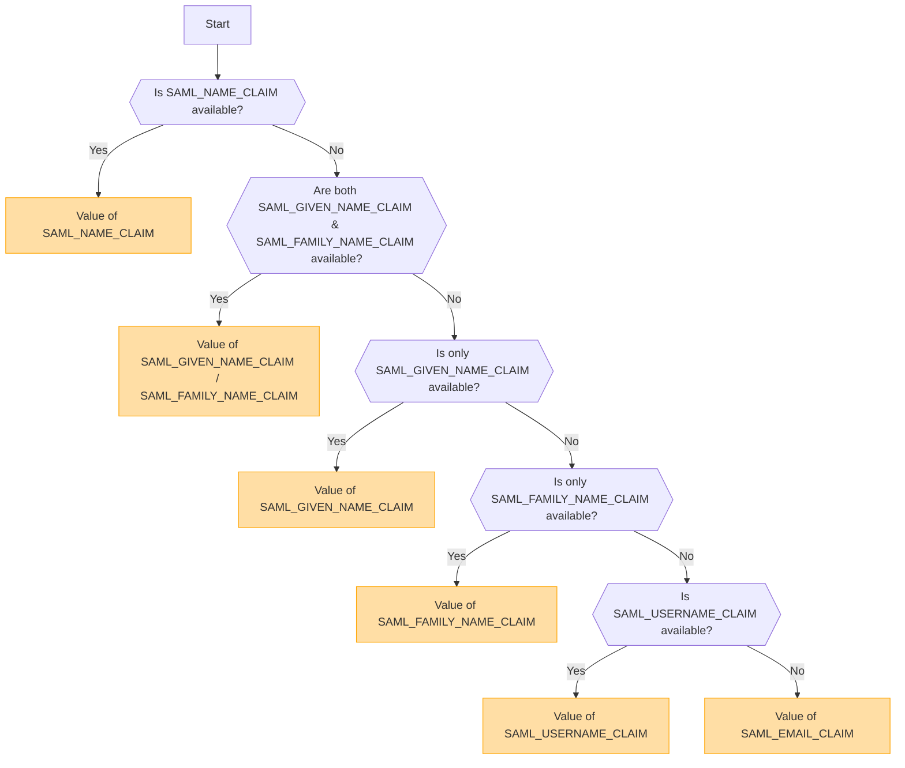

## Panoramica [#overview]

SAML (Security Assertion Markup Language) è un protocollo di autenticazione ampiamente utilizzato che abilita il Single Sign-On (SSO). Consente agli utenti di autenticarsi una sola volta presso un Identity Provider (IdP) e di ottenere l'accesso a molteplici servizi senza dover effettuare nuovamente l'accesso.

<Callout type="warning" title="SLO (Single Logout) non supportato">
Il Single Logout (SLO) non è supportato in questa implementazione.
</Callout>

<Callout type="warning" title="Esclusione reciproca di OpenID e SAML">
Se l'autenticazione OpenID è abilitata, l'autenticazione SAML verrà disabilitata automaticamente.

È possibile attivare solo un metodo di autenticazione alla volta.
</Callout>

## Attivazione del metodo di autenticazione basata sulle variabili d'ambiente [#authentication-method-activation-based-on-environment-variables]

La seguente tabella indica quale metodo di autenticazione è abilitato a seconda delle impostazioni delle variabili d'ambiente:

|   OIDC   |   SAML   | Metodo di autenticazione attivo |
| -------- | -------- | ------------------------------- |
| ✅Abilitato | ❌Disabilitato | OpenID Connect (OIDC)           |
| ❌Disabilitato | ✅Abilitato | SAML                            |
| ✅Abilitato | ✅Abilitato | OpenID Connect (OIDC)           |
| ❌Disabilitato | ❌Disabilitato | Nessuna autenticazione abilitata |

## Formato e configurazione del certificato SAML [#saml-certificate-format-and-configuration]

La variabile d'ambiente `SAML_CERT` viene utilizzata per specificare il certificato di firma dell'Identity Provider (IdP) per la convalida delle risposte SAML. Questo certificato deve essere fornito in **formato PEM** e può essere specificato in uno dei seguenti modi:

### Come percorso file (relativo o assoluto) [#as-a-file-path-relative-or-absolute]

Se `SAML_CERT` è impostato su un percorso di file, l'applicazione caricherà il certificato dal file specificato.
Sono supportati sia i **percorsi relativi** che i **percorsi assoluti**.

```env
# Relative path (resolved based on the application root)
SAML_CERT=idp-cert.pem

# Absolute path
SAML_CERT=/path/to/idp-cert.pem
```

**Contenuto del file di esempio (`idp-cert.pem`):**

```
-----BEGIN CERTIFICATE-----
MIIDazCCAlOgAwIBAgIUKhXaFJGJJPx466rl...
-----END CERTIFICATE-----
```

### Come stringa PEM su una sola riga [#as-a-one-line-pem-string]

Il certificato può anche essere fornito come **stringa PEM su una sola riga** (codificata in Base64, senza interruzioni di riga).

```env
SAML_CERT="MIICizCCAfQCCQCY8tKaMc0BMjANBgkqh...W=="
```

Questo formato è utile quando si memorizza il certificato direttamente nelle variabili d'ambiente.

### Come stringa PEM su più righe (con sequenze di escape \n) [#as-a-multi-line-pem-string-with-n-escape-sequences]

Il certificato può anche essere fornito come una **stringa PEM multilinea** dove le nuove righe sono rappresentate come \n.

```env
SAML_CERT="-----BEGIN CERTIFICATE-----\nMIIDazCCAlOgAwIBAgIUKhXaFJGJJPx466rl...\n-----END CERTIFICATE-----\n"
```

Questo formato è utile quando si configurano i certificati nei file .env preservando l'intera struttura PEM.

### Requisiti del formato del certificato [#certificate-format-requirements]
- Il certificato **deve essere sempre in formato PEM** (certificato X.509 codificato in Base64).
- Se fornito come file, deve essere un **formato PEM di messaggio testuale rigoroso RFC7468** valido.
- Quando si utilizza un certificato su una sola riga, assicurarsi che **non ci siano interruzioni di riga** nel valore.
- Quando si utilizza una stringa multilinea, assicurarsi che le nuove righe siano rappresentate come sequenze di escape **\n**.

Per ulteriori dettagli, fare riferimento alla [documentazione di node-saml](https://github.com/node-saml/node-saml/tree/master?tab=readme-ov-file#configuration-option-idpcert).


## Flusso di determinazione del nome utente visualizzato basato sugli attributi SAML [#display-username-determination-flow-based-on-saml-attributes]


Nell'autenticazione SAML, il nome utente visualizzato viene determinato secondo il seguente flusso.



### Regole di determinazione [#determination-rules]

1. Se `SAML_NAME_CLAIM` viene fornito, il suo valore viene utilizzato come nome utente visualizzato.
2. Se vengono forniti sia `SAML_GIVEN_NAME_CLAIM` che `SAML_FAMILY_NAME_CLAIM`, i loro valori corrispondenti vengono concatenati per formare il nome utente.
3. Se viene fornito solo `SAML_GIVEN_NAME_CLAIM`, viene utilizzato il suo valore.
4. Se viene fornito solo `SAML_FAMILY_NAME_CLAIM`, viene utilizzato il suo valore.
5. Se `SAML_USERNAME_CLAIM` è fornito, viene utilizzato il suo valore.
6. Se nessuno degli attributi di cui sopra viene fornito, `SAML_EMAIL_CLAIM` viene utilizzato come nome utente visualizzato.

Seguendo questo flusso, viene determinato un nome utente appropriato durante l'autenticazione SAML.

## Esempi di configurazione [#configuration-examples]
  - [Auth0](/docs/configuration/authentication/SAML/auth0)

