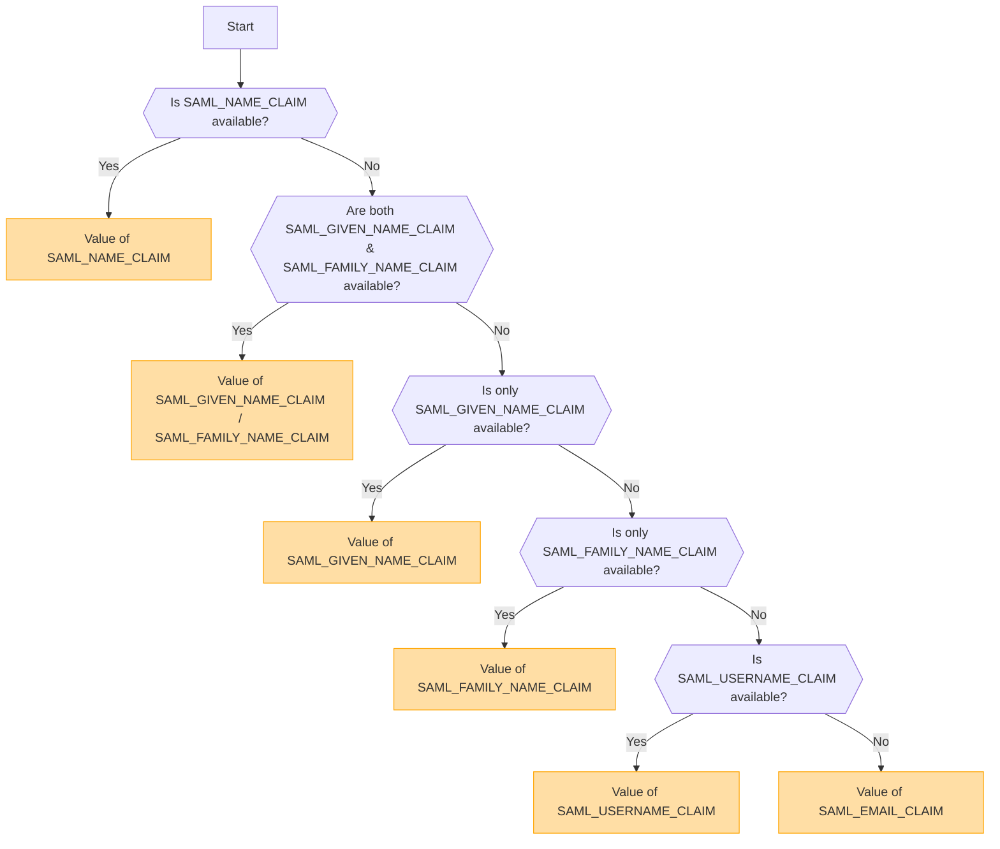

## 概要 [#overview]

SAML (Security Assertion Markup Language) は、シングルサインオン (SSO) を可能にする広く利用されている認証プロトコルです。ユーザーは一度 Identity Provider (IdP) で認証を行うことで、再度ログインすることなく複数のサービスにアクセスできるようになります。

<Callout type="warning" title="SLO (Single Logout) はサポートされていません">
この実装では、シングルログアウト (SLO) はサポートされていません。
</Callout>

<Callout type="warning" title="OpenIDとSAMLの相互排他">
OpenID認証が有効な場合、SAML認証は自動的に無効になります。

一度に有効にできる認証方法は1つだけです。
</Callout>

## 環境変数に基づく認証方法の有効化 [#authentication-method-activation-based-on-environment-variables]

以下の表は、環境変数の設定に応じてどの認証方法が有効になるかを示しています：

|   OIDC   |   SAML   | 有効な認証方法 |
| -------- | -------- | ---------------------------- |
| ✅Enabled  | ❌Disabled | OpenID Connect (OIDC)        |
| ❌Disabled | ✅Enabled  | SAML                         |
| ✅Enabled  | ✅Enabled  | OpenID Connect (OIDC)        |
| ❌Disabled | ❌Disabled | 認証は有効ではありません    |

## SAML 証明書の形式と設定 [#saml-certificate-format-and-configuration]

`SAML_CERT` 環境変数は、SAMLレスポンスを検証するためのアイデンティティプロバイダー（IdP）の署名証明書を指定するために使用されます。この証明書は **PEM形式** で提供する必要があり、以下のいずれかの方法で指定できます。

### ファイルパスとして（相対パスまたは絶対パス） [#as-a-file-path-relative-or-absolute]

`SAML_CERT` がファイルパスに設定されている場合、アプリケーションは指定されたファイルから証明書を読み込みます。
**相対パス**と**絶対パス**の両方がサポートされています。

```env
# Relative path (resolved based on the application root)
SAML_CERT=idp-cert.pem

# Absolute path
SAML_CERT=/path/to/idp-cert.pem
```

**Example File Content (`idp-cert.pem`):**

```
-----BEGIN CERTIFICATE-----
MIIDazCCAlOgAwIBAgIUKhXaFJGJJPx466rl...
-----END CERTIFICATE-----
```

### 1行のPEM文字列として [#as-a-one-line-pem-string]

証明書は、**1行のPEM文字列**（Base64エンコード済み、改行なし）として提供することもできます。

```env
SAML_CERT="MIICizCCAfQCCQCY8tKaMc0BMjANBgkqh...W=="
```

この形式は、証明書を直接環境変数に保存する場合に便利です。

### マルチラインPEM文字列として（\n エスケープシーケンスを含む） [#as-a-multi-line-pem-string-with-n-escape-sequences]

証明書は、改行が \n として表現される **複数行のPEM文字列** として提供することもできます。

```env
SAML_CERT="-----BEGIN CERTIFICATE-----\nMIIDazCCAlOgAwIBAgIUKhXaFJGJJPx466rl...\n-----END CERTIFICATE-----\n"
```

この形式は、PEM構造全体を保持したまま .env ファイルで証明書を設定する場合に便利です。

### 証明書の形式要件 [#certificate-format-requirements]
- 証明書は**常にPEM形式である必要があります**（Base64エンコードされたX.509証明書）。
- ファイルとして提供される場合、それは有効な **RFC7468 strict textual message PEM format** である必要があります。
- 1行の証明書を使用する場合は、値に**改行が含まれていない**ことを確認してください。
- 複数行の文字列を使用する場合は、改行が **\n** エスケープシーケンスとして表現されていることを確認してください。

詳細については、[node-saml documentation](https://github.com/node-saml/node-saml/tree/master?tab=readme-ov-file#configuration-option-idpcert) を参照してください。


## SAML属性に基づく表示ユーザー名の決定フロー [#display-username-determination-flow-based-on-saml-attributes]


SAML認証において、表示されるユーザー名は以下のフローに従って決定されます。



### 決定ルール [#determination-rules]

1. `SAML_NAME_CLAIM` が提供されている場合、その値が表示ユーザー名として使用されます。
2. `SAML_GIVEN_NAME_CLAIM` と `SAML_FAMILY_NAME_CLAIM` の両方が提供されている場合、それらに対応する値が連結されてユーザー名が形成されます。
3. `SAML_GIVEN_NAME_CLAIM` のみが提供されている場合、その値が使用されます。
4. `SAML_FAMILY_NAME_CLAIM` のみが提供されている場合、その値が使用されます。
5. `SAML_USERNAME_CLAIM` が提供されている場合、その値が使用されます。
6. 上記の属性がいずれも提供されない場合、`SAML_EMAIL_CLAIM` が表示ユーザー名として使用されます。

このフローに従うことで、SAML認証中に適切なユーザー名が決定されます。

## 設定例 [#configuration-examples]
  - [Auth0](/docs/configuration/authentication/SAML/auth0)

