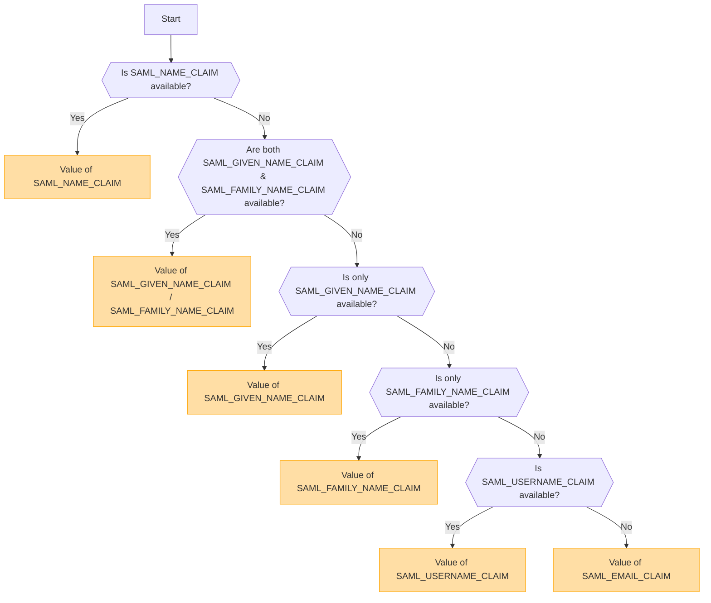

## 개요 [#overview]

SAML (Security Assertion Markup Language)은 Single Sign-On (SSO)을 가능하게 하는 널리 사용되는 인증 프로토콜입니다. 이를 통해 사용자는 Identity Provider (IdP)를 통해 한 번만 인증하면 다시 로그인할 필요 없이 여러 서비스에 액세스할 수 있습니다.

<Callout type="warning" title="SLO (Single Logout) 지원 안 함">
이 구현에서는 Single Logout (SLO)이 지원되지 않습니다.
</Callout>

<Callout type="warning" title="OpenID와 SAML의 상호 배타성">
OpenID 인증이 활성화되면 SAML 인증은 자동으로 비활성화됩니다.

한 번에 하나의 인증 방법만 활성화할 수 있습니다.
</Callout>

## 환경 변수에 기반한 인증 방식 활성화 [#authentication-method-activation-based-on-environment-variables]

다음 표는 환경 변수 설정에 따라 어떤 인증 방법이 활성화되는지를 나타냅니다:

|   OIDC   |   SAML   | 활성화된 인증 방식 |
| -------- | -------- | ---------------------------- |
| ✅Enabled  | ❌Disabled | OpenID Connect (OIDC)        |
| ❌Disabled | ✅Enabled  | SAML                         |
| ✅Enabled  | ✅Enabled  | OpenID Connect (OIDC)        |
| ❌Disabled | ❌Disabled | 인증 비활성화됨    |

## SAML 인증서 형식 및 구성 [#saml-certificate-format-and-configuration]

`SAML_CERT` 환경 변수는 SAML 응답을 검증하기 위한 ID 공급자(IdP)의 서명 인증서를 지정하는 데 사용됩니다. 이 인증서는 반드시 **PEM 형식**이어야 하며 다음 방법 중 하나로 지정할 수 있습니다.

### 파일 경로로 (상대 경로 또는 절대 경로) [#as-a-file-path-relative-or-absolute]

`SAML_CERT`가 파일 경로로 설정된 경우, 애플리케이션은 지정된 파일에서 인증서를 로드합니다.
**상대 경로**와 **절대 경로** 모두 지원됩니다.

```env
# Relative path (resolved based on the application root)
SAML_CERT=idp-cert.pem

# Absolute path
SAML_CERT=/path/to/idp-cert.pem
```

**예시 파일 내용 (`idp-cert.pem`):**

```
-----BEGIN CERTIFICATE-----
MIIDazCCAlOgAwIBAgIUKhXaFJGJJPx466rl...
-----END CERTIFICATE-----
```

### 한 줄 PEM 문자열로 [#as-a-one-line-pem-string]

인증서는 **한 줄짜리 PEM 문자열**(Base64로 인코딩되었으며 줄 바꿈이 없음)로 제공할 수도 있습니다.

```env
SAML_CERT="MIICizCCAfQCCQCY8tKaMc0BMjANBgkqh...W=="
```

이 형식은 인증서를 환경 변수에 직접 저장할 때 유용합니다.

### 여러 줄 PEM 문자열로 ( \n 이스케이프 시퀀스 포함) [#as-a-multi-line-pem-string-with-n-escape-sequences]

인증서는 개행 문자가 \n으로 표시되는 **다중 라인 PEM 문자열(multi-line PEM string)**로 제공될 수도 있습니다.

```env
SAML_CERT="-----BEGIN CERTIFICATE-----\nMIIDazCCAlOgAwIBAgIUKhXaFJGJJPx466rl...\n-----END CERTIFICATE-----\n"
```

이 형식은 .env 파일에서 전체 PEM 구조를 유지하면서 인증서를 구성할 때 유용합니다.

### 인증서 형식 요구 사항 [#certificate-format-requirements]
- 인증서는 **항상 PEM 형식**이어야 합니다(Base64로 인코딩된 X.509 인증서).
- 파일로 제공되는 경우, 반드시 유효한 **RFC7468 strict textual message PEM format**이어야 합니다.
- 한 줄 인증서를 사용할 때는 값에 **줄 바꿈이 없는지** 확인하세요.
- 여러 줄 문자열을 사용할 때는 줄 바꿈이 **\n** 이스케이프 시퀀스로 표현되도록 하십시오.

더 자세한 내용은 [node-saml documentation](https://github.com/node-saml/node-saml/tree/master?tab=readme-ov-file#configuration-option-idpcert)을 참조하세요.


## SAML 속성에 기반한 표시 사용자 이름 결정 흐름 [#display-username-determination-flow-based-on-saml-attributes]


SAML 인증에서 표시 사용자 이름은 다음 흐름에 따라 결정됩니다.



### 결정 규칙 [#determination-rules]

1. `SAML_NAME_CLAIM`이 제공되면, 해당 값이 표시 사용자 이름으로 사용됩니다.
2. `SAML_GIVEN_NAME_CLAIM`과 `SAML_FAMILY_NAME_CLAIM`이 모두 제공되면, 해당 값들이 결합되어 사용자 이름이 생성됩니다.
3. `SAML_GIVEN_NAME_CLAIM`만 제공된 경우, 해당 값이 사용됩니다.
4. `SAML_FAMILY_NAME_CLAIM`만 제공된 경우, 해당 값이 사용됩니다.
5. `SAML_USERNAME_CLAIM`이 제공되면 해당 값이 사용됩니다.
6. 위의 속성 중 어느 것도 제공되지 않으면, `SAML_EMAIL_CLAIM`이 표시 사용자 이름으로 사용됩니다.

이 흐름을 따르면 SAML 인증 중에 적절한 사용자 이름이 결정됩니다.

## 구성 예시 [#configuration-examples]
  - [Auth0](/docs/configuration/authentication/SAML/auth0)

