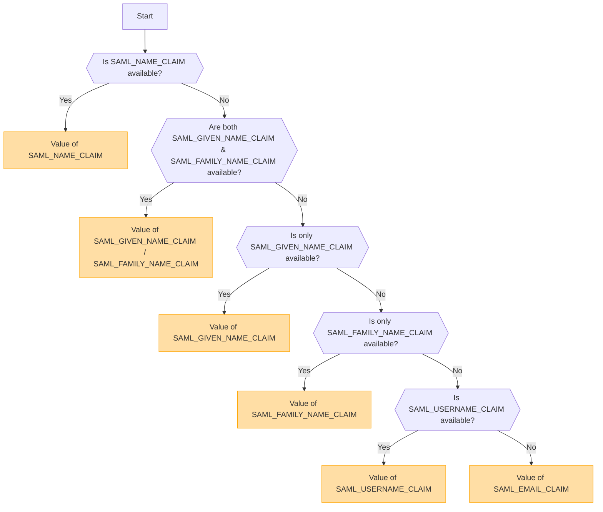

## Overzicht [#overview]

SAML (Security Assertion Markup Language) is een veelgebruikt authenticatieprotocol dat Single Sign-On (SSO) mogelijk maakt. Het stelt gebruikers in staat om zich eenmalig te authenticeren bij een Identity Provider (IdP) en toegang te krijgen tot meerdere diensten zonder opnieuw te hoeven inloggen.

<Callout type="warning" title="SLO (Single Logout) wordt niet ondersteund">
Single Logout (SLO) wordt niet ondersteund in deze implementatie.
</Callout>

<Callout type="warning" title="Wederzijdse uitsluiting van OpenID en SAML">
Als OpenID-authenticatie is ingeschakeld, wordt SAML-authenticatie automatisch uitgeschakeld.

Er kan slechts één authenticatiemethode tegelijk actief zijn.
</Callout>

## Authenticatiemethode activeren op basis van omgevingsvariabelen [#authentication-method-activation-based-on-environment-variables]

De volgende tabel geeft aan welke authenticatiemethode is ingeschakeld, afhankelijk van de instellingen van de omgevingsvariabelen:

|   OIDC   |   SAML   | Actieve authenticatiemethode |
| -------- | -------- | ---------------------------- |
| ✅Ingeschakeld  | ❌Uitgeschakeld | OpenID Connect (OIDC)        |
| ❌Uitgeschakeld | ✅Ingeschakeld  | SAML                         |
| ✅Ingeschakeld  | ✅Ingeschakeld  | OpenID Connect (OIDC)        |
| ❌Uitgeschakeld | ❌Uitgeschakeld | Geen authenticatie ingeschakeld    |

## SAML-certificaatformaat en -configuratie [#saml-certificate-format-and-configuration]

De `SAML_CERT` omgevingsvariabele wordt gebruikt om het ondertekeningscertificaat van de Identity Provider (IdP) op te geven voor het valideren van SAML-responses. Dit certificaat moet worden aangeleverd in **PEM-formaat** en kan op een van de volgende manieren worden opgegeven:

### Als een bestandspad (relatief of absoluut) [#as-a-file-path-relative-or-absolute]

Als `SAML_CERT` is ingesteld op een bestandspad, zal de applicatie het certificaat laden vanuit het opgegeven bestand.
Zowel **relatieve paden** als **absolute paden** worden ondersteund.

```env
# Relative path (resolved based on the application root)
SAML_CERT=idp-cert.pem

# Absolute path
SAML_CERT=/path/to/idp-cert.pem
```

**Voorbeeld bestandsinhoud (`idp-cert.pem`):**

```
-----BEGIN CERTIFICATE-----
MIIDazCCAlOgAwIBAgIUKhXaFJGJJPx466rl...
-----END CERTIFICATE-----
```

### Als een One-Line PEM String [#as-a-one-line-pem-string]

Het certificaat kan ook worden verstrekt als een **one-line PEM string** (Base64-gecodeerd, zonder regeleinden).

```env
SAML_CERT="MIICizCCAfQCCQCY8tKaMc0BMjANBgkqh...W=="
```

Dit formaat is handig wanneer het certificaat direct in omgevingsvariabelen wordt opgeslagen.

### Als een Multi-Line PEM String (met \n escape-sequenties) [#as-a-multi-line-pem-string-with-n-escape-sequences]

Het certificaat kan ook worden verstrekt als een **multi-line PEM string** waarbij regeleinden worden weergegeven als \n.

```env
SAML_CERT="-----BEGIN CERTIFICATE-----\nMIIDazCCAlOgAwIBAgIUKhXaFJGJJPx466rl...\n-----END CERTIFICATE-----\n"
```

Dit formaat is nuttig bij het configureren van certificaten in .env bestanden, terwijl de volledige PEM-structuur behouden blijft.

### Vereisten voor certificaatindeling [#certificate-format-requirements]
- Het certificaat **moet altijd in PEM-formaat zijn** (Base64-gecodeerd X.509-certificaat).
- Indien verstrekt als bestand, moet het een geldig **RFC7468 strict textual message PEM format** zijn.
- Wanneer je een certificaat op één regel gebruikt, zorg er dan voor dat er **geen regeleinden** in de waarde staan.
- Bij gebruik van een multi-line string, zorg ervoor dat regeleinden worden weergegeven als **\n** escape-sequenties.

Voor meer details, raadpleeg de [node-saml documentation](https://github.com/node-saml/node-saml/tree/master?tab=readme-ov-file#configuration-option-idpcert).


## Stroom voor het bepalen van de weergavenaam op basis van SAML-attributen [#display-username-determination-flow-based-on-saml-attributes]


Bij SAML-authenticatie wordt de weergavenaam van de gebruiker bepaald volgens het volgende proces.



### Bepalingsregels [#determination-rules]

1. Als `SAML_NAME_CLAIM` is opgegeven, wordt de waarde ervan gebruikt als de weergavenaam van de gebruiker.
2. Als zowel `SAML_GIVEN_NAME_CLAIM` als `SAML_FAMILY_NAME_CLAIM` zijn opgegeven, worden hun bijbehorende waarden samengevoegd om de gebruikersnaam te vormen.
3. Als alleen `SAML_GIVEN_NAME_CLAIM` is opgegeven, wordt de waarde daarvan gebruikt.
4. Als alleen `SAML_FAMILY_NAME_CLAIM` is opgegeven, wordt de waarde daarvan gebruikt.
5. Als `SAML_USERNAME_CLAIM` is opgegeven, wordt de waarde daarvan gebruikt.
6. Als geen van de bovenstaande attributen is opgegeven, wordt `SAML_EMAIL_CLAIM` gebruikt als de weergavegebruikersnaam.

Door dit proces te volgen, wordt er tijdens SAML-authenticatie een passende gebruikersnaam bepaald.

## Configuratievoorbeelden [#configuration-examples]
  - [Auth0](/docs/configuration/authentication/SAML/auth0)

