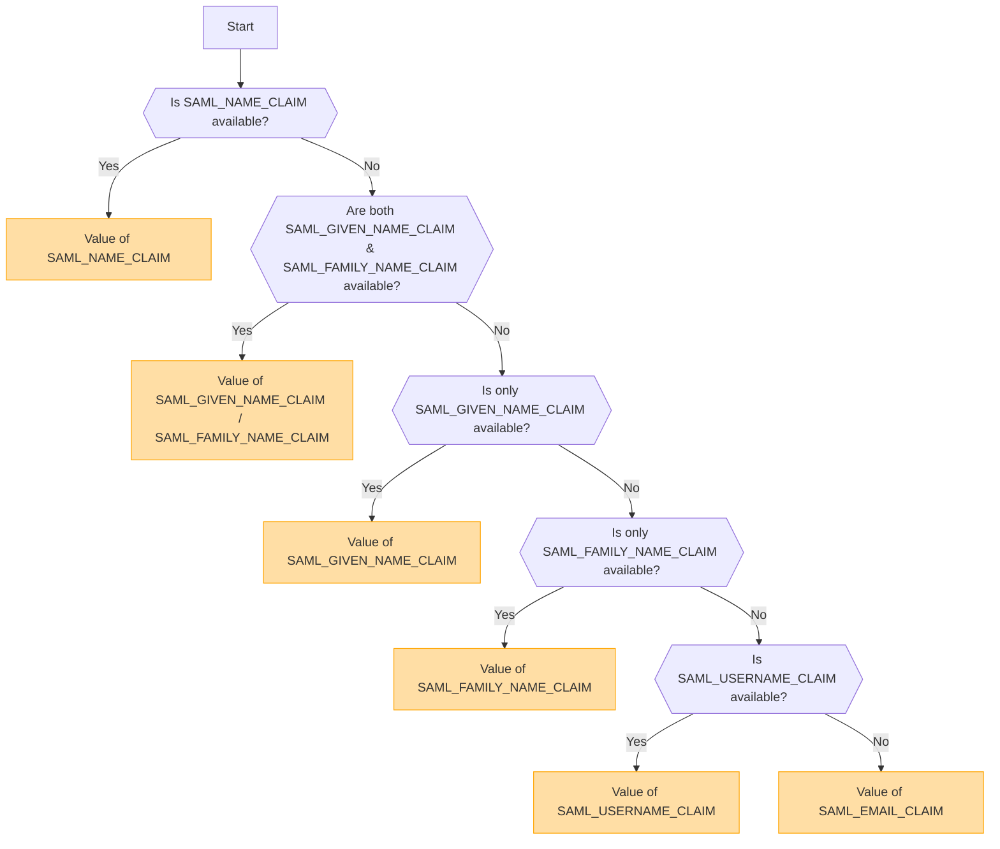

## Przegląd [#overview]

SAML (Security Assertion Markup Language) to szeroko stosowany protokół uwierzytelniania, który umożliwia logowanie jednokrotne (Single Sign-On, SSO). Pozwala on użytkownikom na jednokrotne uwierzytelnienie się u dostawcy tożsamości (Identity Provider, IdP) i uzyskanie dostępu do wielu usług bez konieczności ponownego logowania.

<Callout type="warning" title="SLO (Single Logout) nie jest obsługiwane">
Single Logout (SLO) nie jest obsługiwane w tej implementacji.
</Callout>

<Callout type="warning" title="Wzajemne wykluczenie OpenID i SAML">
Jeśli uwierzytelnianie OpenID jest włączone, uwierzytelnianie SAML zostanie automatycznie wyłączone.

Tylko jedna metoda uwierzytelniania może być aktywna w danym momencie.
</Callout>

## Aktywacja metody uwierzytelniania na podstawie zmiennych środowiskowych [#authentication-method-activation-based-on-environment-variables]

Poniższa tabela wskazuje, która metoda uwierzytelniania jest włączona w zależności od ustawień zmiennych środowiskowych:

|   OIDC   |   SAML   | Aktywna metoda uwierzytelniania |
| -------- | -------- | ---------------------------- |
| ✅Włączone | ❌Wyłączone | OpenID Connect (OIDC)        |
| ❌Wyłączone | ✅Włączone | SAML                         |
| ✅Włączone | ✅Włączone | OpenID Connect (OIDC)        |
| ❌Wyłączone | ❌Wyłączone | Brak włączonego uwierzytelniania |

## Format i konfiguracja certyfikatu SAML [#saml-certificate-format-and-configuration]

Zmienna środowiskowa `SAML_CERT` służy do określenia certyfikatu podpisywania dostawcy tożsamości (IdP) w celu weryfikacji odpowiedzi SAML. Certyfikat ten musi zostać dostarczony w **formacie PEM** i może zostać określony na jeden z poniższych sposobów:

### Jako ścieżka pliku (względna lub bezwzględna) [#as-a-file-path-relative-or-absolute]

Jeśli `SAML_CERT` jest ustawione na ścieżkę do pliku, aplikacja wczyta certyfikat ze wskazanego pliku.
Obsługiwane są zarówno **ścieżki względne**, jak i **ścieżki bezwzględne**.

```env
# Relative path (resolved based on the application root)
SAML_CERT=idp-cert.pem

# Absolute path
SAML_CERT=/path/to/idp-cert.pem
```

**Przykładowa zawartość pliku (`idp-cert.pem`):**

```
-----BEGIN CERTIFICATE-----
MIIDazCCAlOgAwIBAgIUKhXaFJGJJPx466rl...
-----END CERTIFICATE-----
```

### Jako jednowierszowy ciąg PEM [#as-a-one-line-pem-string]

Certyfikat można również dostarczyć jako **jednoliniowy ciąg PEM** (zakodowany w Base64, bez znaków nowej linii).

```env
SAML_CERT="MIICizCCAfQCCQCY8tKaMc0BMjANBgkqh...W=="
```

Ten format jest przydatny podczas przechowywania certyfikatu bezpośrednio w zmiennych środowiskowych.

### Jako wieloliniowy ciąg PEM (z sekwencjami ucieczki \n) [#as-a-multi-line-pem-string-with-n-escape-sequences]

Certyfikat można również dostarczyć jako **wieloliniowy ciąg PEM**, w którym znaki nowej linii są reprezentowane jako \n.

```env
SAML_CERT="-----BEGIN CERTIFICATE-----\nMIIDazCCAlOgAwIBAgIUKhXaFJGJJPx466rl...\n-----END CERTIFICATE-----\n"
```

Ten format jest przydatny podczas konfigurowania certyfikatów w plikach .env przy jednoczesnym zachowaniu pełnej struktury PEM.

### Wymagania dotyczące formatu certyfikatu [#certificate-format-requirements]
- Certyfikat **musi być zawsze w formacie PEM** (certyfikat X.509 zakodowany w Base64).
- Jeśli zostanie dostarczony jako plik, musi być w poprawnym formacie **RFC7468 strict textual message PEM**.
- Podczas używania certyfikatu jednowierszowego upewnij się, że w wartości **nie ma znaków nowej linii**.
- Podczas używania wieloliniowego ciągu znaków upewnij się, że znaki nowej linii są reprezentowane jako sekwencje ucieczki **\n**.

Aby uzyskać więcej szczegółów, zapoznaj się z [dokumentacją node-saml](https://github.com/node-saml/node-saml/tree/master?tab=readme-ov-file#configuration-option-idpcert).


## Przepływ ustalania wyświetlanej nazwy użytkownika na podstawie atrybutów SAML [#display-username-determination-flow-based-on-saml-attributes]


W uwierzytelnianiu SAML wyświetlana nazwa użytkownika jest określana zgodnie z poniższym przepływem.



### Zasady określania [#determination-rules]

1. Jeśli podano `SAML_NAME_CLAIM`, jego wartość jest używana jako wyświetlana nazwa użytkownika.
2. Jeśli podano zarówno `SAML_GIVEN_NAME_CLAIM`, jak i `SAML_FAMILY_NAME_CLAIM`, ich odpowiadające im wartości są łączone w celu utworzenia nazwy użytkownika.
3. Jeśli podano tylko `SAML_GIVEN_NAME_CLAIM`, używana jest jego wartość.
4. Jeśli podano tylko `SAML_FAMILY_NAME_CLAIM`, używana jest jego wartość.
5. Jeśli podano `SAML_USERNAME_CLAIM`, używana jest jego wartość.
6. Jeśli żaden z powyższych atrybutów nie zostanie podany, `SAML_EMAIL_CLAIM` jest używany jako wyświetlana nazwa użytkownika.

Postępując zgodnie z tym przepływem, odpowiednia nazwa użytkownika jest określana podczas uwierzytelniania SAML.

## Przykłady konfiguracji [#configuration-examples]
  - [Auth0](/docs/configuration/authentication/SAML/auth0)

