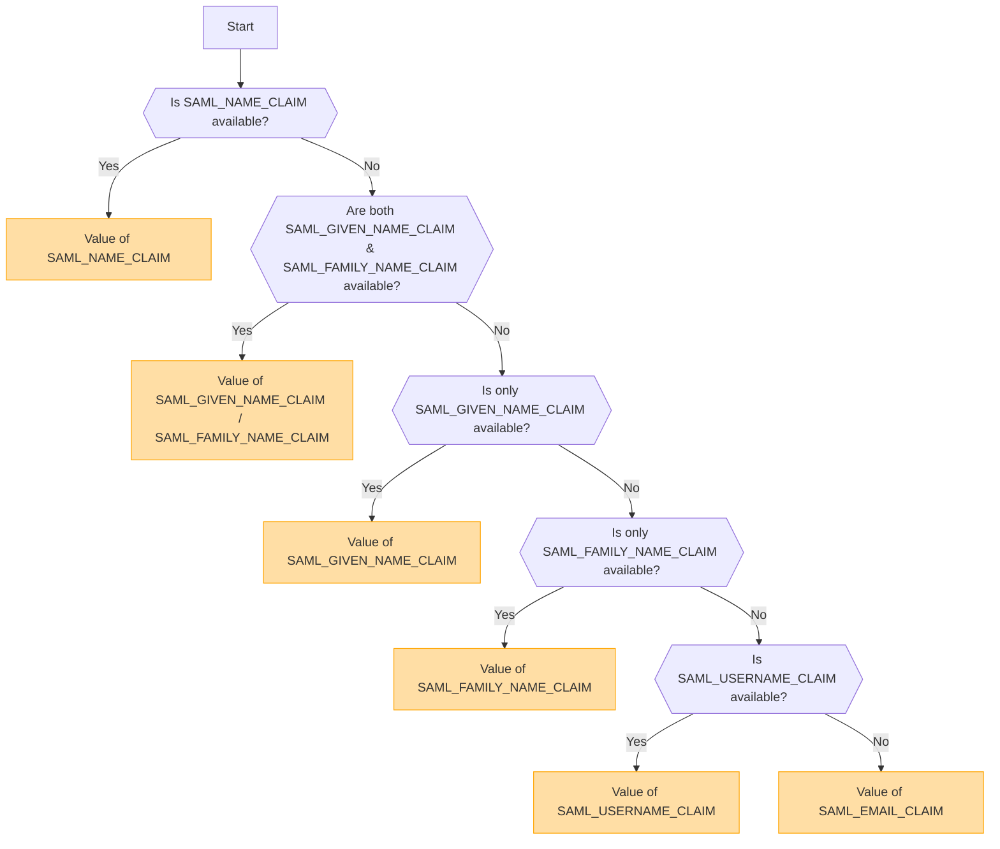

## Visão geral [#overview]

SAML (Security Assertion Markup Language) é um protocolo de autenticação amplamente utilizado que permite o Single Sign-On (SSO). Ele permite que os usuários se autentiquem uma vez com um Provedor de Identidade (IdP) e obtenham acesso a múltiplos serviços sem a necessidade de fazer login novamente.

<Callout type="warning" title="SLO (Single Logout) não suportado">
Single Logout (SLO) não é suportado nesta implementação.
</Callout>

<Callout type="warning" title="Exclusão Mútua de OpenID e SAML">
Se a autenticação OpenID estiver habilitada, a autenticação SAML será desabilitada automaticamente.

Apenas um método de autenticação pode estar ativo por vez.
</Callout>

## Ativação do Método de Autenticação Baseada em Variáveis de Ambiente [#authentication-method-activation-based-on-environment-variables]

A tabela a seguir indica qual método de autenticação está habilitado dependendo das configurações das variáveis de ambiente:

|   OIDC   |   SAML   | Método de Autenticação Ativo |
| -------- | -------- | ---------------------------- |
| ✅Enabled  | ❌Disabled | OpenID Connect (OIDC)        |
| ❌Disabled | ✅Enabled  | SAML                         |
| ✅Enabled  | ✅Enabled  | OpenID Connect (OIDC)        |
| ❌Disabled | ❌Disabled | Nenhuma autenticação ativada |

## Formato e Configuração de Certificado SAML [#saml-certificate-format-and-configuration]

A variável de ambiente `SAML_CERT` é usada para especificar o certificado de assinatura do Provedor de Identidade (IdP) para validar Respostas SAML. Este certificado deve ser fornecido no **formato PEM** e pode ser especificado de uma das seguintes maneiras:

### Como um Caminho de Arquivo (Relativo ou Absoluto) [#as-a-file-path-relative-or-absolute]

Se `SAML_CERT` estiver definido como um caminho de arquivo, a aplicação carregará o certificado a partir do arquivo especificado.
Tanto **caminhos relativos** quanto **caminhos absolutos** são suportados.

```env
# Relative path (resolved based on the application root)
SAML_CERT=idp-cert.pem

# Absolute path
SAML_CERT=/path/to/idp-cert.pem
```

**Exemplo de conteúdo do arquivo (`idp-cert.pem`):**

```
-----BEGIN CERTIFICATE-----
MIIDazCCAlOgAwIBAgIUKhXaFJGJJPx466rl...
-----END CERTIFICATE-----
```

### Como uma String PEM de Linha Única [#as-a-one-line-pem-string]

O certificado também pode ser fornecido como uma **string PEM de linha única** (codificada em Base64, sem quebras de linha).

```env
SAML_CERT="MIICizCCAfQCCQCY8tKaMc0BMjANBgkqh...W=="
```

Este formato é útil ao armazenar o certificado diretamente em variáveis de ambiente.

### Como uma String PEM de Múltiplas Linhas (com sequências de escape \n) [#as-a-multi-line-pem-string-with-n-escape-sequences]

O certificado também pode ser fornecido como uma **string PEM de múltiplas linhas**, onde as quebras de linha são representadas como \n.

```env
SAML_CERT="-----BEGIN CERTIFICATE-----\nMIIDazCCAlOgAwIBAgIUKhXaFJGJJPx466rl...\n-----END CERTIFICATE-----\n"
```

Este formato é útil ao configurar certificados em arquivos .env, preservando a estrutura PEM completa.

### Requisitos de Formato de Certificado [#certificate-format-requirements]
- O certificado **deve estar sempre no formato PEM** (certificado X.509 codificado em Base64).
- Se fornecido como um arquivo, ele deve ser um **formato PEM de mensagem textual estrita RFC7468** válido.
- Ao usar um certificado de uma linha, certifique-se de que **não haja quebras de linha** no valor.
- Ao usar uma string de múltiplas linhas, certifique-se de que as quebras de linha sejam representadas como sequências de escape **\n**.

Para mais detalhes, consulte a [documentação do node-saml](https://github.com/node-saml/node-saml/tree/master?tab=readme-ov-file#configuration-option-idpcert).


## Fluxo de Determinação do Nome de Exibição do Usuário com Base em Atributos SAML [#display-username-determination-flow-based-on-saml-attributes]


Na autenticação SAML, o nome de usuário de exibição é determinado de acordo com o seguinte fluxo.



### Regras de Determinação [#determination-rules]

1. Se `SAML_NAME_CLAIM` for fornecido, seu valor será usado como o nome de usuário de exibição.
2. Se tanto `SAML_GIVEN_NAME_CLAIM` quanto `SAML_FAMILY_NAME_CLAIM` forem fornecidos, seus valores correspondentes serão concatenados para formar o nome de usuário.
3. Se apenas `SAML_GIVEN_NAME_CLAIM` for fornecido, seu valor será usado.
4. Se apenas `SAML_FAMILY_NAME_CLAIM` for fornecido, seu valor será usado.
5. Se `SAML_USERNAME_CLAIM` for fornecido, seu valor será usado.
6. Se nenhum dos atributos acima for fornecido, `SAML_EMAIL_CLAIM` será usado como o nome de usuário de exibição.

Ao seguir este fluxo, um nome de usuário apropriado é determinado durante a autenticação SAML.

## Exemplos de Configuração [#configuration-examples]
  - [Auth0](/docs/configuration/authentication/SAML/auth0)

