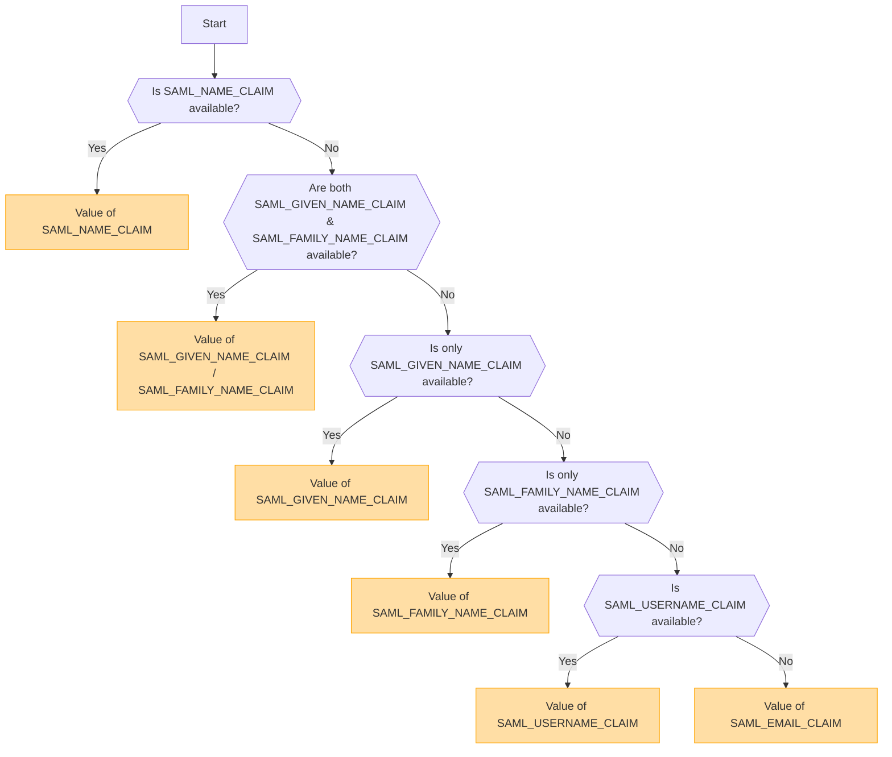

## Genel Bakış [#overview]

SAML (Security Assertion Markup Language), Tek Oturum Açma (SSO) özelliğini etkinleştiren, yaygın olarak kullanılan bir kimlik doğrulama protokolüdür. Kullanıcıların bir Kimlik Sağlayıcı (IdP) ile bir kez kimlik doğrulaması yapmasına ve tekrar giriş yapmaya gerek kalmadan birden fazla hizmete erişim sağlamasına olanak tanır.

<Callout type="warning" title="SLO (Single Logout) Desteklenmiyor">
Bu uygulamada Single Logout (SLO) desteklenmemektedir.
</Callout>

<Callout type="warning" title="OpenID ve SAML'in Karşılıklı Dışlanması">
OpenID kimlik doğrulaması etkinleştirilirse, SAML kimlik doğrulaması otomatik olarak devre dışı bırakılacaktır.

Aynı anda yalnızca bir kimlik doğrulama yöntemi aktif olabilir.
</Callout>

## Ortam Değişkenlerine Dayalı Kimlik Doğrulama Yöntemi Etkinleştirme [#authentication-method-activation-based-on-environment-variables]

Aşağıdaki tablo, ortam değişkeni ayarlarına bağlı olarak hangi kimlik doğrulama yönteminin etkinleştirildiğini gösterir:

|   OIDC   |   SAML   | Etkin Kimlik Doğrulama Yöntemi |
| -------- | -------- | ---------------------------- |
| ✅Etkin  | ❌Devre Dışı | OpenID Connect (OIDC)        |
| ❌Devre Dışı | ✅Etkin  | SAML                         |
| ✅Etkin  | ✅Etkin  | OpenID Connect (OIDC)        |
| ❌Devre Dışı | ❌Devre Dışı | Kimlik doğrulama etkin değil |

## SAML Sertifika Formatı ve Yapılandırması [#saml-certificate-format-and-configuration]

`SAML_CERT` ortam değişkeni, SAML Yanıtlarını doğrulamak için Kimlik Sağlayıcısının (IdP) imzalama sertifikasını belirtmek amacıyla kullanılır. Bu sertifika **PEM formatında** sağlanmalı ve aşağıdaki yollardan biriyle belirtilebilir:

### Dosya Yolu Olarak (Göreceli veya Mutlak) [#as-a-file-path-relative-or-absolute]

`SAML_CERT` bir dosya yoluna ayarlanmışsa, uygulama sertifikayı belirtilen dosyadan yükleyecektir.
Hem **göreli yollar** hem de **mutlak yollar** desteklenmektedir.

```env
# Relative path (resolved based on the application root)
SAML_CERT=idp-cert.pem

# Absolute path
SAML_CERT=/path/to/idp-cert.pem
```

**Örnek Dosya İçeriği (`idp-cert.pem`):**

```
-----BEGIN CERTIFICATE-----
MIIDazCCAlOgAwIBAgIUKhXaFJGJJPx466rl...
-----END CERTIFICATE-----
```

### Tek Satırlık PEM Dizgisi Olarak [#as-a-one-line-pem-string]

Sertifika ayrıca **tek satırlık bir PEM dizgisi** (Base64 kodlu, satır sonları olmadan) olarak da sağlanabilir.

```env
SAML_CERT="MIICizCCAfQCCQCY8tKaMc0BMjANBgkqh...W=="
```

Bu format, sertifikayı doğrudan ortam değişkenlerinde saklarken kullanışlıdır.

### Çok Satırlı PEM Dizgisi Olarak (\n kaçış dizileriyle) [#as-a-multi-line-pem-string-with-n-escape-sequences]

Sertifika, yeni satırların \n olarak temsil edildiği **çok satırlı bir PEM dizgisi** olarak da sağlanabilir.

```env
SAML_CERT="-----BEGIN CERTIFICATE-----\nMIIDazCCAlOgAwIBAgIUKhXaFJGJJPx466rl...\n-----END CERTIFICATE-----\n"
```

Bu format, .env dosyalarında sertifikaları yapılandırırken tam PEM yapısını korumak için kullanışlıdır.

### Sertifika Formatı Gereksinimleri [#certificate-format-requirements]
- Sertifika **her zaman PEM formatında** (Base64 kodlu X.509 sertifikası) olmalıdır.
- Bir dosya olarak sağlandığında, geçerli bir **RFC7468 katı metinsel mesaj PEM formatında** olmalıdır.
- Tek satırlık bir sertifika kullanırken, değer içinde **satır sonu (line break)** olmadığından emin olun.
- Çok satırlı bir dizge kullanırken, yeni satırların **\n** kaçış dizileri olarak temsil edildiğinden emin olun.

Daha fazla ayrıntı için [node-saml documentation](https://github.com/node-saml/node-saml/tree/master?tab=readme-ov-file#configuration-option-idpcert) bölümüne bakın.


## SAML Özniteliklerine Dayalı Görünen Kullanıcı Adı Belirleme Akışı [#display-username-determination-flow-based-on-saml-attributes]


SAML kimlik doğrulamasında, görünen kullanıcı adı aşağıdaki akışa göre belirlenir.



### Belirleme Kuralları [#determination-rules]

1. Eğer `SAML_NAME_CLAIM` sağlanmışsa, değeri görünen kullanıcı adı olarak kullanılır.
2. Hem `SAML_GIVEN_NAME_CLAIM` hem de `SAML_FAMILY_NAME_CLAIM` sağlanmışsa, kullanıcı adını oluşturmak için ilgili değerleri birleştirilir.
3. Yalnızca `SAML_GIVEN_NAME_CLAIM` sağlanmışsa, değeri kullanılır.
4. Yalnızca `SAML_FAMILY_NAME_CLAIM` sağlanmışsa, değeri kullanılır.
5. Eğer `SAML_USERNAME_CLAIM` sağlanmışsa, değeri kullanılır.
6. Yukarıdaki özniteliklerden hiçbiri sağlanmazsa, görünen kullanıcı adı olarak `SAML_EMAIL_CLAIM` kullanılır.

Bu akışı takip ederek, SAML kimlik doğrulaması sırasında uygun bir kullanıcı adı belirlenir.

## Yapılandırma Örnekleri [#configuration-examples]
  - [Auth0](/docs/configuration/authentication/SAML/auth0)

