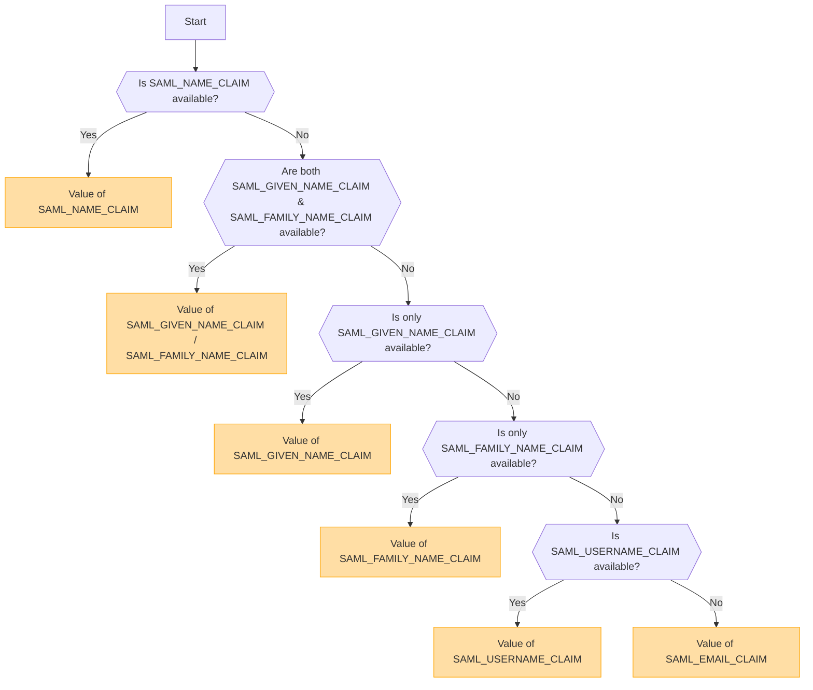

## Tổng quan [#overview]

SAML (Security Assertion Markup Language) là một giao thức xác thực được sử dụng rộng rãi, cho phép thực hiện Đăng nhập một lần (SSO). Giao thức này cho phép người dùng xác thực một lần với Nhà cung cấp danh tính (IdP) và có quyền truy cập vào nhiều dịch vụ mà không cần phải đăng nhập lại.

<Callout type="warning" title="SLO (Single Logout) không được hỗ trợ">
Single Logout (SLO) không được hỗ trợ trong triển khai này.
</Callout>

<Callout type="warning" title="Loại trừ lẫn nhau giữa OpenID và SAML">
Nếu xác thực OpenID được bật, xác thực SAML sẽ tự động bị vô hiệu hóa.

Chỉ một phương thức xác thực có thể được kích hoạt tại một thời điểm.
</Callout>

## Kích hoạt phương thức xác thực dựa trên các biến môi trường [#authentication-method-activation-based-on-environment-variables]

Bảng sau đây chỉ ra phương thức xác thực nào được kích hoạt tùy thuộc vào các cài đặt biến môi trường:

|   OIDC   |   SAML   | Phương thức xác thực đang hoạt động |
| -------- | -------- | ---------------------------- |
| ✅Đã bật  | ❌Đã tắt | OpenID Connect (OIDC)        |
| ❌Đã tắt | ✅Đã bật  | SAML                         |
| ✅Đã bật  | ✅Đã bật  | OpenID Connect (OIDC)        |
| ❌Đã tắt | ❌Đã tắt | Không có xác thực nào được bật    |

## Định dạng và Cấu hình Chứng chỉ SAML [#saml-certificate-format-and-configuration]

Biến môi trường `SAML_CERT` được sử dụng để chỉ định chứng chỉ ký của Nhà cung cấp danh tính (IdP) nhằm xác thực các Phản hồi SAML. Chứng chỉ này phải được cung cấp ở **định dạng PEM** và có thể được chỉ định theo một trong các cách sau:

### Dưới dạng Đường dẫn Tệp (Tương đối hoặc Tuyệt đối) [#as-a-file-path-relative-or-absolute]

Nếu `SAML_CERT` được đặt thành một đường dẫn tệp, ứng dụng sẽ tải chứng chỉ từ tệp được chỉ định.
Cả **đường dẫn tương đối** và **đường dẫn tuyệt đối** đều được hỗ trợ.

```env
# Relative path (resolved based on the application root)
SAML_CERT=idp-cert.pem

# Absolute path
SAML_CERT=/path/to/idp-cert.pem
```

**Nội dung tệp ví dụ (`idp-cert.pem`):**

```
-----BEGIN CERTIFICATE-----
MIIDazCCAlOgAwIBAgIUKhXaFJGJJPx466rl...
-----END CERTIFICATE-----
```

### Dưới dạng chuỗi PEM một dòng [#as-a-one-line-pem-string]

Chứng chỉ cũng có thể được cung cấp dưới dạng **chuỗi PEM một dòng** (được mã hóa Base64, không có ngắt dòng).

```env
SAML_CERT="MIICizCCAfQCCQCY8tKaMc0BMjANBgkqh...W=="
```

Định dạng này hữu ích khi lưu trữ chứng chỉ trực tiếp trong các biến môi trường.

### Dưới dạng chuỗi PEM nhiều dòng (với các chuỗi thoát \n) [#as-a-multi-line-pem-string-with-n-escape-sequences]

Chứng chỉ cũng có thể được cung cấp dưới dạng **chuỗi PEM nhiều dòng**, trong đó các ký tự xuống dòng được biểu thị bằng \n.

```env
SAML_CERT="-----BEGIN CERTIFICATE-----\nMIIDazCCAlOgAwIBAgIUKhXaFJGJJPx466rl...\n-----END CERTIFICATE-----\n"
```

Định dạng này rất hữu ích khi cấu hình chứng chỉ trong các tệp .env mà vẫn bảo toàn được toàn bộ cấu trúc PEM.

### Yêu cầu về định dạng chứng chỉ [#certificate-format-requirements]
- Chứng chỉ **phải luôn ở định dạng PEM** (chứng chỉ X.509 được mã hóa Base64).
- Nếu được cung cấp dưới dạng tệp, tệp đó phải là **định dạng PEM thông báo văn bản nghiêm ngặt RFC7468** hợp lệ.
- Khi sử dụng chứng chỉ một dòng, hãy đảm bảo **không có ngắt dòng** trong giá trị.
- Khi sử dụng chuỗi nhiều dòng, hãy đảm bảo các dòng mới được biểu thị dưới dạng các chuỗi thoát **\n**.

Để biết thêm chi tiết, hãy tham khảo [tài liệu node-saml](https://github.com/node-saml/node-saml/tree/master?tab=readme-ov-file#configuration-option-idpcert).


## Quy trình xác định tên người dùng hiển thị dựa trên các thuộc tính SAML [#display-username-determination-flow-based-on-saml-attributes]


Trong xác thực SAML, tên người dùng hiển thị được xác định theo quy trình sau.



### Các quy tắc xác định [#determination-rules]

1. Nếu `SAML_NAME_CLAIM` được cung cấp, giá trị của nó sẽ được sử dụng làm tên người dùng hiển thị.
2. Nếu cả `SAML_GIVEN_NAME_CLAIM` và `SAML_FAMILY_NAME_CLAIM` đều được cung cấp, các giá trị tương ứng của chúng sẽ được nối lại để tạo thành tên người dùng.
3. Nếu chỉ cung cấp `SAML_GIVEN_NAME_CLAIM`, giá trị của nó sẽ được sử dụng.
4. Nếu chỉ cung cấp `SAML_FAMILY_NAME_CLAIM`, giá trị của nó sẽ được sử dụng.
5. Nếu `SAML_USERNAME_CLAIM` được cung cấp, giá trị của nó sẽ được sử dụng.
6. Nếu không có thuộc tính nào ở trên được cung cấp, `SAML_EMAIL_CLAIM` sẽ được sử dụng làm tên người dùng hiển thị.

Bằng cách tuân theo quy trình này, một tên người dùng phù hợp sẽ được xác định trong quá trình xác thực SAML.

## Các ví dụ về cấu hình [#configuration-examples]
  - [Auth0](/docs/configuration/authentication/SAML/auth0)

