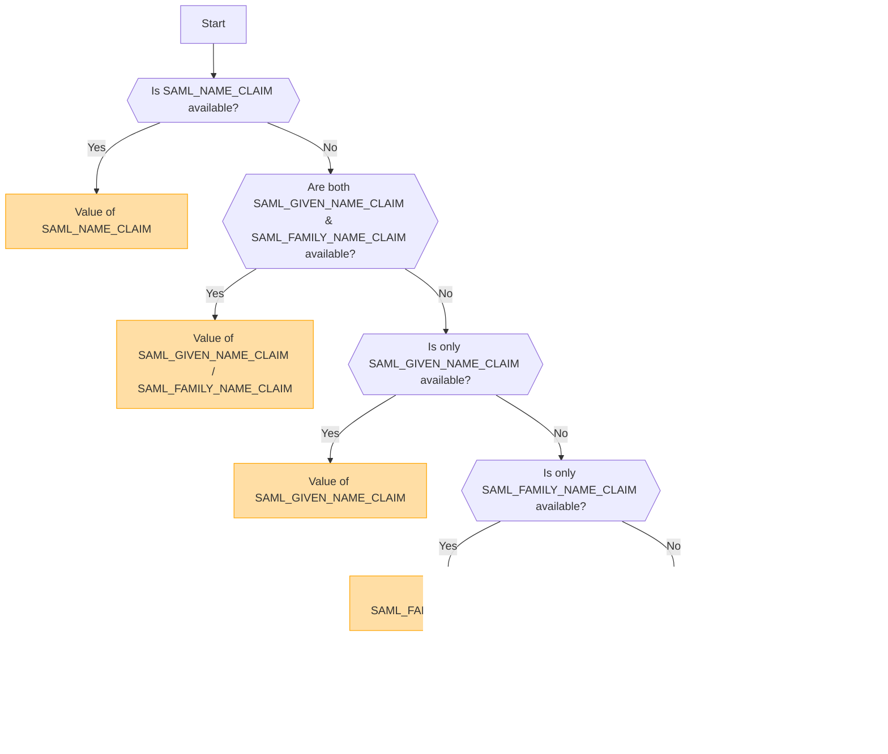

## 概述 [#overview]

SAML (Security Assertion Markup Language) 是一种广泛使用的身份验证协议，支持单点登录 (SSO)。它允许用户通过身份提供商 (IdP) 进行一次身份验证，即可访问多个服务，而无需再次登录。

<Callout type="warning" title="不支持 SLO (Single Logout)">
此实现不支持单点注销 (SLO)。
</Callout>

<Callout type="warning" title="OpenID 与 SAML 的互斥性">
如果启用了 OpenID 身份验证，SAML 身份验证将自动禁用。

同一时间只能启用一种身份验证方法。
</Callout>

## 基于环境变量的身份验证方法激活 [#authentication-method-activation-based-on-environment-variables]

下表显示了根据环境变量设置启用的身份验证方法：

|   OIDC   |   SAML   | 当前启用的身份验证方法 |
| -------- | -------- | ---------------------------- |
| ✅已启用  | ❌已禁用 | OpenID Connect (OIDC)        |
| ❌已禁用 | ✅已启用  | SAML                         |
| ✅已启用  | ✅已启用  | OpenID Connect (OIDC)        |
| ❌已禁用 | ❌已禁用 | 未启用身份验证    |

## SAML 证书格式与配置 [#saml-certificate-format-and-configuration]

`SAML_CERT` 环境变量用于指定身份提供商 (IdP) 的签名证书，以验证 SAML 响应。此证书必须以 **PEM 格式**提供，并可通过以下任一方式指定：

### 作为文件路径（相对或绝对） [#as-a-file-path-relative-or-absolute]

如果 `SAML_CERT` 被设置为文件路径，应用程序将从指定文件中加载证书。
同时支持**相对路径**和**绝对路径**。

```env
# Relative path (resolved based on the application root)
SAML_CERT=idp-cert.pem

# Absolute path
SAML_CERT=/path/to/idp-cert.pem
```

**示例文件内容 (`idp-cert.pem`):**

```
-----BEGIN CERTIFICATE-----
MIIDazCCAlOgAwIBAgIUKhXaFJGJJPx466rl...
-----END CERTIFICATE-----
```

### 作为单行 PEM 字符串 [#as-a-one-line-pem-string]

该证书也可以作为**单行 PEM 字符串**（Base64 编码，无换行符）提供。

```env
SAML_CERT="MIICizCCAfQCCQCY8tKaMc0BMjANBgkqh...W=="
```

当直接在环境变量中存储证书时，此格式非常有用。

### 作为多行 PEM 字符串（带有 \n 转义序列） [#as-a-multi-line-pem-string-with-n-escape-sequences]

该证书也可以作为**多行 PEM 字符串**提供，其中换行符表示为 \n。

```env
SAML_CERT="-----BEGIN CERTIFICATE-----\nMIIDazCCAlOgAwIBAgIUKhXaFJGJJPx466rl...\n-----END CERTIFICATE-----\n"
```

当在 .env 文件中配置证书并需要保留完整的 PEM 结构时，此格式非常有用。

### 证书格式要求 [#certificate-format-requirements]
- 该证书**必须始终为 PEM 格式**（Base64 编码的 X.509 证书）。
- 如果以文件形式提供，它必须是有效的 **RFC7468 严格文本消息 PEM 格式**。
- 使用单行证书时，请确保该值中**没有换行符**。
- 当使用多行字符串时，请确保换行符表示为 **\n** 转义序列。

有关更多详细信息，请参阅 [node-saml documentation](https://github.com/node-saml/node-saml/tree/master?tab=readme-ov-file#configuration-option-idpcert)。


## 基于 SAML 属性的显示用户名确定流程 [#display-username-determination-flow-based-on-saml-attributes]


在 SAML 身份验证中，显示用户名是根据以下流程确定的。



### 判定规则 [#determination-rules]

1. 如果提供了 `SAML_NAME_CLAIM`，其值将被用作显示用户名。
2. 如果同时提供了 `SAML_GIVEN_NAME_CLAIM` 和 `SAML_FAMILY_NAME_CLAIM`，它们对应的值将被拼接以形成用户名。
3. 如果仅提供了 `SAML_GIVEN_NAME_CLAIM`，则使用其值。
4. 如果仅提供了 `SAML_FAMILY_NAME_CLAIM`，则使用其值。
5. 如果提供了 `SAML_USERNAME_CLAIM`，则使用其值。
6. 如果未提供上述任何属性，则使用 `SAML_EMAIL_CLAIM` 作为显示用户名。

通过遵循此流程，可以在 SAML 身份验证期间确定合适的用户名。

## 配置示例 [#configuration-examples]
  - [Auth0](/docs/configuration/authentication/SAML/auth0)

