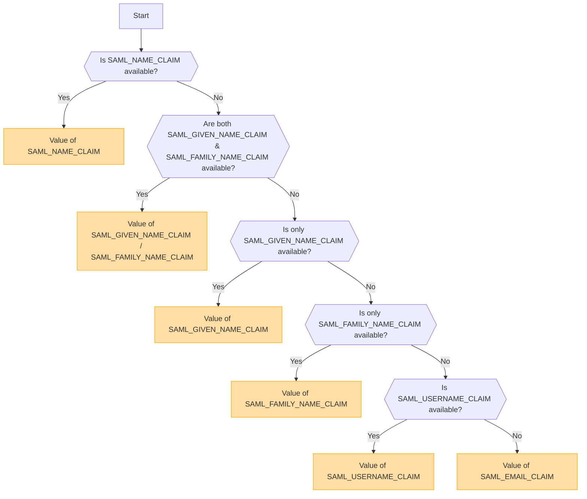

# SAML Authentication

## Overview

SAML (Security Assertion Markup Language) is a widely used authentication
protocol that enables Single Sign-On (SSO). It allows users to authenticate once
with an Identity Provider (IdP) and gain access to multiple services without
needing to log in again.

<Callout type="warning" title="SLO (Single Logout) Not Supported">
  Single Logout (SLO) is not supported in this implementation.
</Callout>

<Callout type="warning" title="Mutual Exclusion of OpenID and SAML">
If OpenID authentication is enabled, SAML authentication will be automatically disabled.

Only one authentication method can be active at a time.

</Callout>

## Authentication Method Activation Based on Environment Variables

The following table indicates which authentication method is enabled depending
on the environment variable settings:

| OIDC       | SAML       | Active Authentication Method |
| ---------- | ---------- | ---------------------------- |
| ✅Enabled  | ❌Disabled | OpenID Connect (OIDC)        |
| ❌Disabled | ✅Enabled  | SAML                         |
| ✅Enabled  | ✅Enabled  | OpenID Connect (OIDC)        |
| ❌Disabled | ❌Disabled | No authentication enabled    |

## SAML Certificate Format and Configuration

The `SAML_CERT` environment variable is used to specify the Identity Provider’s (IdP) signing certificate for validating SAML Responses. This certificate must be provided in **PEM format** and can be specified in one of the following ways:

### As a File Path (Relative or Absolute)

If `SAML_CERT` is set to a file path, the application will load the certificate from the specified file.
Both **relative paths** and **absolute paths** are supported.

```env
# Relative path (resolved based on the application root)
SAML_CERT=idp-cert.pem

# Absolute path
SAML_CERT=/path/to/idp-cert.pem
```

**Example File Content (`idp-cert.pem`):**

```
-----BEGIN CERTIFICATE-----
MIIDazCCAlOgAwIBAgIUKhXaFJGJJPx466rl...
-----END CERTIFICATE-----
```

### As a One-Line PEM String

The certificate can also be provided as a **one-line PEM string** (Base64-encoded, without line breaks).

```env
SAML_CERT="MIICizCCAfQCCQCY8tKaMc0BMjANBgkqh...W=="
```

This format is useful when storing the certificate directly in environment variables.

### As a Multi-Line PEM String (with \n escape sequences)

The certificate can also be provided as a **multi-line PEM string** where newlines are represented as \n.

```env
SAML_CERT="-----BEGIN CERTIFICATE-----\nMIIDazCCAlOgAwIBAgIUKhXaFJGJJPx466rl...\n-----END CERTIFICATE-----\n"
```

This format is useful when configuring certificates in .env files while preserving the full PEM structure.

### Certificate Format Requirements

- The certificate **must always be in PEM format** (Base64-encoded X.509 certificate).
- If provided as a file, it must be a valid **RFC7468 strict textual message PEM format**.
- When using a one-line certificate, ensure there are **no line breaks** in the value.
- When using a multi-line string, ensure newlines are represented as **\n** escape sequences.

For more details, refer to the [node-saml documentation](https://github.com/node-saml/node-saml/tree/master?tab=readme-ov-file#configuration-option-idpcert).

## Display Username Determination Flow Based on SAML Attributes


In SAML authentication, the display username is determined according to the following flow.



### Determination Rules

1. If `SAML_NAME_CLAIM` is provided, its value is used as the display username.
2. If both `SAML_GIVEN_NAME_CLAIM` and `SAML_FAMILY_NAME_CLAIM` are provided, their corresponding values are concatenated to form the username.
3. If only `SAML_GIVEN_NAME_CLAIM` is provided, its value is used.
4. If only `SAML_FAMILY_NAME_CLAIM` is provided, its value is used.
5. If `SAML_USERNAME_CLAIM` is provided, its value is used.
6. If none of the above attributes are provided, `SAML_EMAIL_CLAIM` is used as the display username.

By following this flow, an appropriate username is determined during SAML authentication.

## Configuration Examples

- [Auth0](/docs/configuration/authentication/SAML/auth0)
